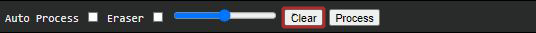
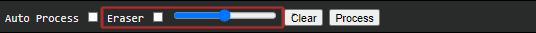

<!--
*** Thanks for checking out the Best-README-Template. If you have a suggestion
*** that would make this better, please fork the repo and create a pull request
*** or simply open an issue with the tag "enhancement".
*** Thanks again! Now go create something AMAZING! :D
***
***
***
*** To avoid retyping too much info. Do a search and replace for the following:
*** Eversmile12, susanna-server, VittoRivabella, email, project_title, project_description
-->


<!-- PROJECT SHIELDS -->
<!--
*** I'm using markdown "reference style" links for readability.
*** Reference links are enclosed in brackets [ ] instead of parentheses ( ).
*** See the bottom of this document for the declaration of the reference variables
*** for contributors-url, forks-url, etc. This is an optional, concise syntax you may use.
*** https://www.markdownguide.org/basic-syntax/#reference-style-links
-->


[](./LICENSE.txt)


<!-- PROJECT LOGO -->
<br />
<p align="center">
  <h3 align="center">Susanna Demo Client 🔧</h3> 

  <p align="center">
    This client aims on providing an easy to use interface to test our Python RESTful API - Susanna.
    <br />
    <a href="https://github.com/Eversmile12/susanna-server"><strong>Server Repository »</strong></a>
    <br />
    <br />
    <a href="https://github.com/Eversmile12/susanna-server/issues">Report Bug</a>
    ·
    <a href="https://github.com/Eversmile12/susanna-server/issues">Request Feature</a>
  </p>
</p>


<!-- ABOUT THE PROJECT -->
## About The Project

This Demo Client aims on providing an easy to use interface to test the Susanna RESTful API.

*Please refer to the [Susanna Server Documentation](https://github.com/Eversmile12/susanna-server) for more informations about this project.*

### Installation


1. Clone the repo.
   ```sh
   $ git clone https://github.com/Eversmile12/susanna-client.git
   ```
2. Open the project folder using the terminal and open the file **index.html**

Attention: A running Susanna Server is mandatory for the client to run.

*Refer to the [Server Documentation](https://github.com/Eversmile12/susanna-server) for further informations.*
 


<!-- USAGE EXAMPLES -->
## ✍️ Usage
Although the Demo Client UI is very minimal, there are a couple of tools worth showing:


#### Compute drawings
1. Use the process button to compute:

This will trigger the Neural Network **once**, retrieving the processed drawing.

2. Use the Auto Update function:<br>  

This will trigger the Neural Network **everytime** you stop clicking on the canvas.
(Attention: When auto is activated, avoid fast and discontinuous strokes)

3. Clear the canvas:

Will Clear the entire canvas.

4. Eraser and Eraser Radius

Standard eraser tool with stroke radius.

<!-- CONTRIBUTING -->
## 🙏 Contributing
*Refer to the [Server Documentation](https://github.com/Eversmile12/susanna-server) for further informations.* 


<!-- LICENSE -->
## License

Distributed under the GNU GPL V3.0 License. See `LICENSE` for more information.


<!-- CONTACT -->
## Contact

Vittorio Rivabella - [@VittorioRivabella](https://www.linkedin.com/in/vittorio-rivabella/) - iwasvitto@gmail.com
<br />
Michele Vece - michelevece40@gmail.com 

Project Link: [https://github.com/Eversmile12/susanna-server](https://github.com/Eversmile12/susanna-server)
